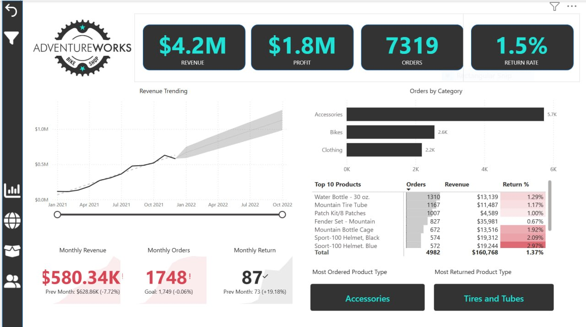
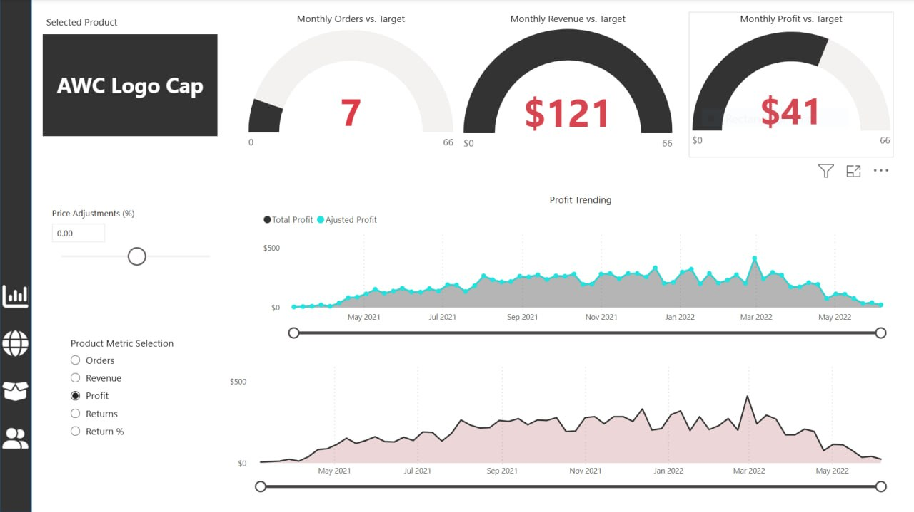
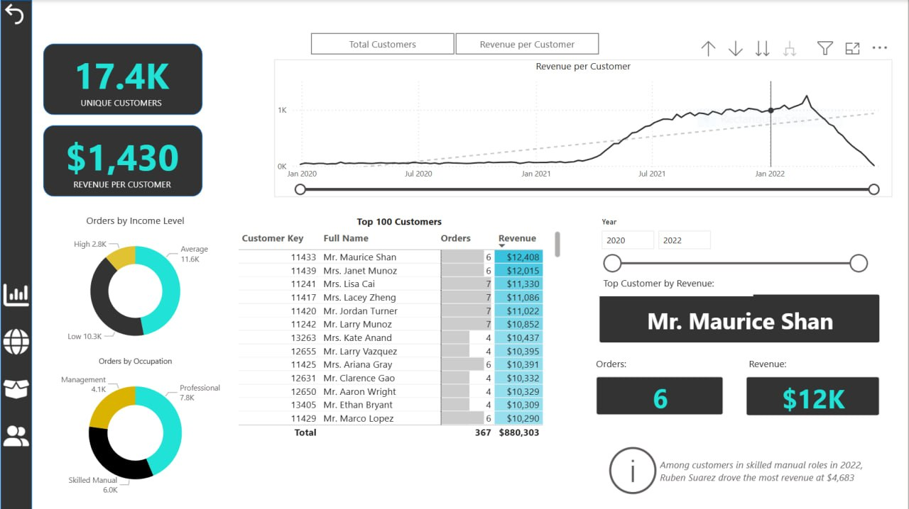

# AdventureWorks Power BI Dashboard

A complete Power BI report for the global cycling equipment manufacturer.  
Helps management track **KPIs (sales, revenue, profit, returns)**, compare **regional performance**, analyze **product-level trends**, and identify **high-value customers**.

## Features
- Sales & Revenue trends (YTD, YoY, monthly)
- Profit & Return rate analysis
- Regional comparison (with maps)
- Top products & high-value customer segmentation
- Interactive filters & drill-through

## How to Use
1. Download and install **Power BI Desktop** (free).
2. Clone this repo.
3. Open `Territory Lookup.pbix` (or the .Report folder).
4. Click **Refresh** if needed (data source instructions below).

## Data Source
AdventureWorks sample database from Microsoft → [Download here](https://learn.microsoft.com/en-us/sql/samples/adventureworks-install-configure).

## Screenshots

## Tech Stack
- Power BI Desktop
- DAX for measures
- Power Query for data transformation

## Author
Sroy Liza — [[LinkedIn](https://www.linkedin.com/in/lizasroy99/)] | Built for management KPI tracking
